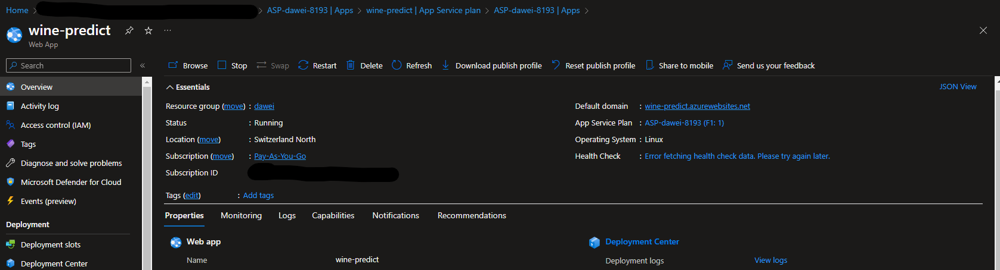
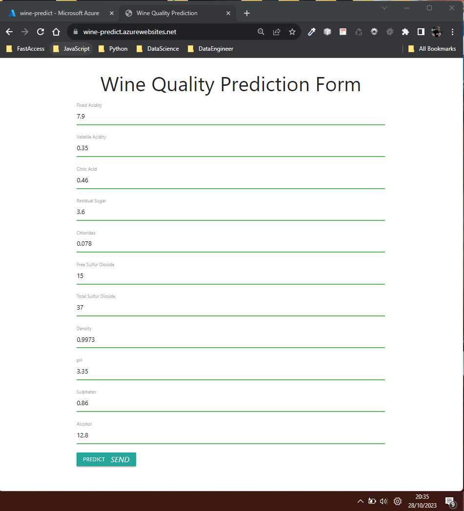
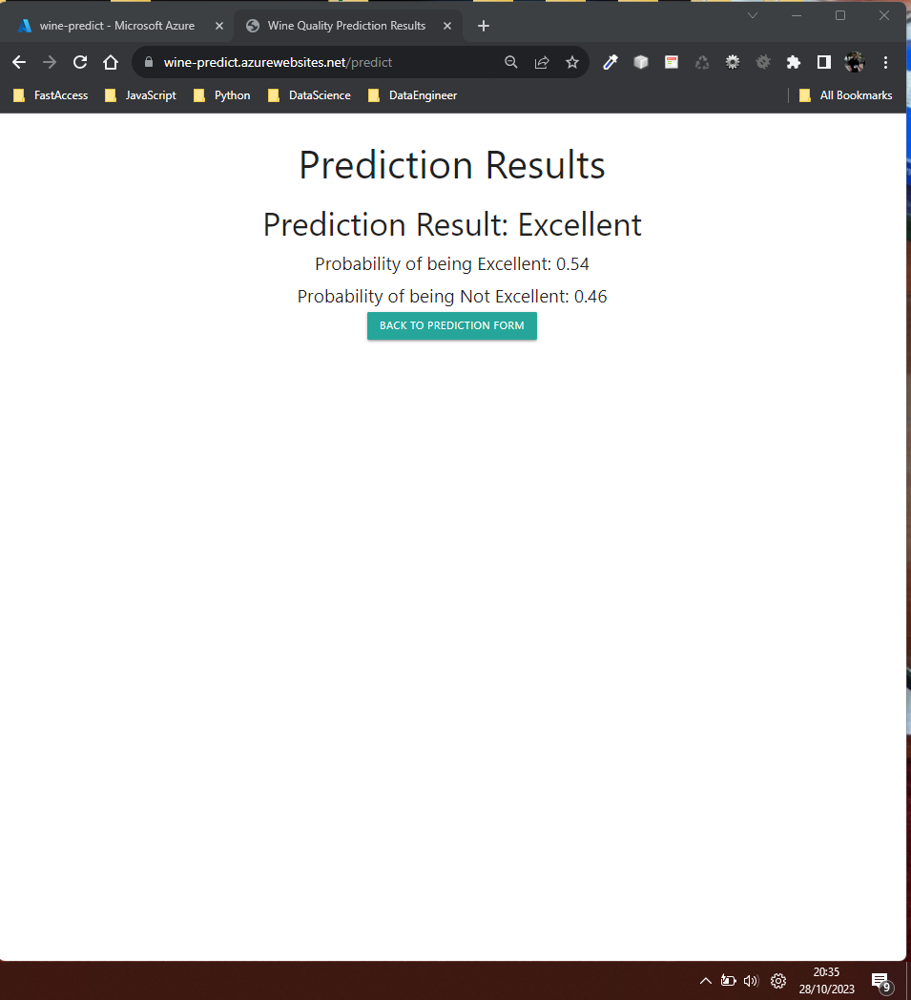
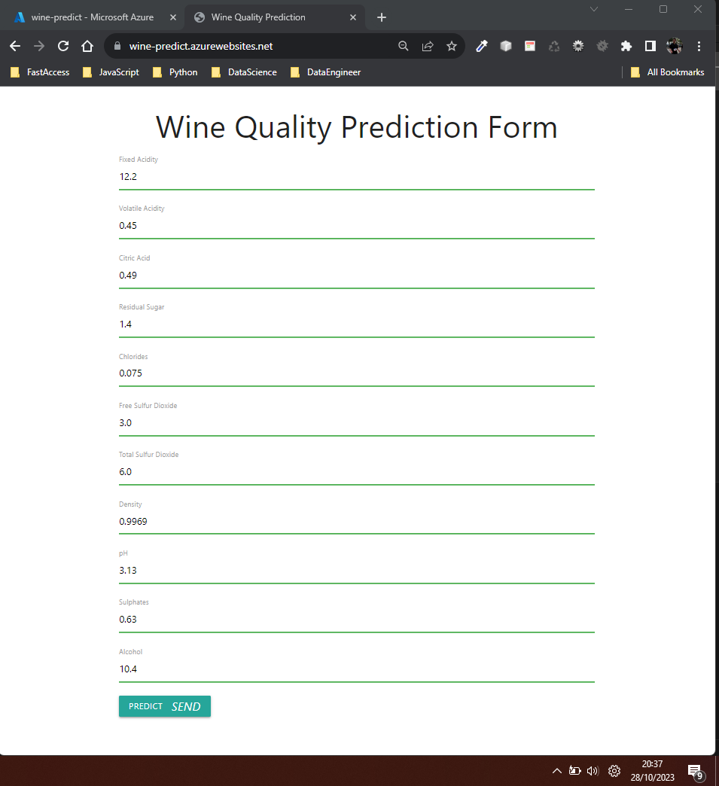
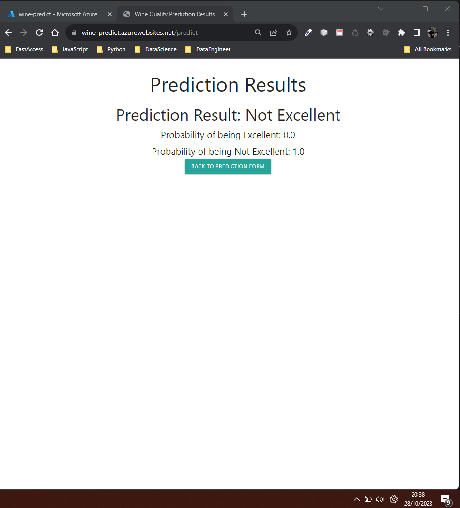

# Wine Quality Classification by David Schmid
#### Author Linkedin: https://www.linkedin.com/in/david-schmid-56194772/

## Table of Contents
- [Overview](#overview)
- [Data Description](#data-description)
- [Setup](#setup)
- [Usage](#usage)
- [Evaluation Metrics](#evaluation-metrics)
- [Results](#results)
- [Deployment on Azure WebServiceApp](#deployment-on-azure-webserviceapp)
- [Prediction Screenshots](#prediction-screenshots)
- [License](#license)

## Overview
This project aims to classify wines into two categories based on their quality:
- **Excellent**: Wines with quality scores of 7 & 8
- **Not Excellent**: Wines with any other quality scores

The classification is achieved using various machine learning models, and the performance of these models is then compared using various metrics.
At the end the best model Random_forest is deployed as a web application using FastApi and Docker.
Moreover it is deployed on Azure as WebServiceApp and can be accessed [here](https://wine-predict.azurewebsites.net/).

## Data Description
- The dataset consists of physicochemical tests of wines, including features like fixed acidity, volatile acidity, citric acid, and more.
- The dataset is from Kaggle and can be found [here](https://www.kaggle.com/datasets/uciml/red-wine-quality-cortez-et-al-2009/data?select=winequality-red.csv).
- The target variable is quality, which is reclassified as `excellent`, which is a binary representation of the wine's quality.
- The dataset contains 1599 rows and 11 features and 1 Target variable quality, which is reclassified as `excellent`, which is a binary representation of the wine's quality.

## Setup to run the Model & Website in Docker
1. Clone this repository.
2. Install the required libraries:
```pip install -r requirements.txt```
3. Run the following command to build the Docker image:
```docker build -t winequality_prediction_app .```

## Usage
1. Run the following command to run the Docker container:
```docker run -p 8080:8080 winequality_prediction_app```
2. Open your browser and go to http://localhost:8080/.
3. Enter your wine's physicochemical test results.
4. Click on the "Predict" button to see the prediction result.
5. **Testing**: 
   For testing purposes, you can use the sample values from `test_results.csv`.

    - **Excellent Wine Sample:**

      | Fixed Acidity | Volatile Acidity | Citric Acid | Residual Sugar | Chlorides | Free Sulfur Dioxide | Total Sulfur Dioxide | Density | pH  | Sulphates | Alcohol | Actual Label | Predicted Label |
      |---------------|------------------|-------------|----------------|-----------|---------------------|----------------------|---------|-----|-----------|---------|--------------|-----------------|
      | 10.3          | 0.32             | 0.45        | 6.4            | 0.073     | 5.0                 | 13.0                 | 0.9976  | 3.23| 0.82      | 12.6    | 1            | 1               |

    - **Not Excellent Wine Sample:**

      | Fixed Acidity | Volatile Acidity | Citric Acid | Residual Sugar | Chlorides | Free Sulfur Dioxide | Total Sulfur Dioxide | Density  | pH  | Sulphates | Alcohol | Actual Label | Predicted Label |
      |---------------|------------------|-------------|----------------|-----------|---------------------|----------------------|----------|-----|-----------|---------|--------------|-----------------|
      | 7.2           | 0.695            | 0.13        | 2.0            | 0.076     | 12.0                | 20.0                 | 0.99546  | 3.29| 0.54      | 10.1    | 0            | 0               |

## Evaluation Metrics
The models are evaluated based on the following metrics:
- **Accuracy**: Percentage of correctly classified instances.
- **Precision**: Percentage of correct positive identifications.
- **Recall**: Percentage of actual positives identified correctly.
- **F1 Score**: Harmonic mean of precision and recall.
- **AUC-ROC**: Area under the receiver operating characteristic curve.

## Results
Performance of the models based on the evaluation metrics:

| Model                 | Accuracy | F1 Score | Precision | Recall | AUC-ROC |
|-----------------------|----------|----------|-----------|--------|---------|
| Logistic Regression   | 0.8818   | 0.4284   | 0.6142    | 0.3317 | 0.8766  |
| Decision Tree         | 0.8712   | 0.5510   | 0.5410    | 0.5904 | 0.7413  |
| Random Forest         | 0.9168   | 0.5983   | 0.7475    | 0.5026 | 0.9153  |
| Support Vector Machine| 0.8874   | 0.4154   | 0.7070    | 0.2949 | 0.8535  |
| Gradient Boosting     | 0.9031   | 0.5968   | 0.6896    | 0.5258 | 0.9021  |


## Deployment on Azure WebServiceApp
The model is deployed on Azure as WebServiceApp and can be accessed [here](https://wine-predict.azurewebsites.net/).
I simply used my Docker image to deploy it on Azure.
The docker image is stored on my DockerHub account and is the same as the one used in this repository.
```docker pull dawei7/winequality_prediction_app```
See here the screenshot of the deployment:


## Prediction Screenshots






## License
This project is licensed under the MIT License - see the `LICENSE.md` file for details.